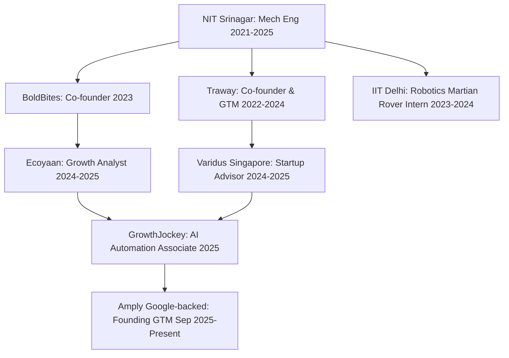

# Career & Education

## Academic Profile

### **National Institute of Technology (NIT), Srinagar**
- **Degree**: B.Tech in Mechanical Engineering (Oct 2021 – Jun 2025)
- **Academic Performance**: CGPA: **8.12/10**
- **Highlights**: Strong focus on quantitative engineering, robotics, process optimization, and system dynamics.

### **The Higher Education Target (MBA & Strategy)**
- **Previous Goal**: MS in Business Analytics (MSBA) at UT Dallas (obtained admission & 50% scholarship). The goal was to gain a technical x business skillset with a STEM designation for a 3-year OPT work visa.
- **The Pivot**: Due to peak US visa restrictions, the goal has shifted to pursuing an MBA at top-tier institutions.
- **Current Targets**:
  - **India**: Top IIMs (IIMA, IIMB, IIMC, IIMK, IIMI) or ideally **ISB** (Indian School of Business).
  - **Europe**: Top MBA programs in **Ireland** (preferred destination) or **Germany**.
- **Historical Reference**: [UTD Statement of Purpose (SOP)](file:///Users/rahiuppal/Desktop/LIFE/AIS-OS-personal/PersonalOS/00_System/UTDSOP.pdf) serves as a background reference detailing the J&K origins and early analytics projects.

---

## Career Trajectory

### **1. Amply (Google-backed)** | *Founding GTM / AI Automation Engineer* (Sep 2025 – Present)
- Deployed 20+ production-grade n8n workflows.
- Architected centralized SQLite data layer.
- Mastered Smartlead, Apollo, HubSpot, and custom MCP integrations.
- Built multichannel AI orchestration systems, saving $1,000/month.

### **2. GrowthJockey** | *Product Associate & GTM Engineer* (Feb 2025 – Sep 2025)
- Built automated cold outreach and high-deliverability email pipelines.
- Engineered WABA (WhatsApp Business API) messaging engine for EV manufacturer, slashing infrastructure costs by 90%.

### **3. Varidus (Singapore)** | *Startup Advisor (Data & Automation)* (Nov 2024 – Mar 2025)
- Built lead research pipelines and Looker Studio dashboards for 4,500+ YC startups.
- Received strong professional recommendation from CEO (MIT Sloan / IIT Bombay Alum).

### **4. Ecoyaan** | *Growth Analyst* (Dec 2024 – Mar 2025)
- Automated seller onboarding with GPT models, improving conversion rates by 20%.

### **5. IIT Delhi** | *Robotics Project Intern* (Dec 2023 – Feb 2024)
- Developed a fully operational Martian Rover under the mentorship of Dr. Jitendra P. Khatait.

## Independent Consulting & AI Automation Projects

A comprehensive portfolio of custom AI workflow engineering, GTM integrations, and strategic consulting delivered directly to founders and tech companies.

All client cases, sourcing strategies, solutions, and project metrics are tracked in the dedicated **[Freelance OS Ledger](file:///Users/rahiuppal/Desktop/LIFE/AIS-OS-personal/PersonalOS/15_Freelance_OS/Ledger.md)**.

### Featured Engagements
- **[PMAPS (HR Tech - $2M ARR)](file:///Users/rahiuppal/Desktop/LIFE/AIS-OS-personal/PersonalOS/15_Freelance_OS/Clients/PMAPS.md)**: Built an end-to-end custom LinkedIn outreach engine using n8n and Unipile API for 5 BDRs, automating outbound workflows and replacing manual connection/DM limits.
- **[HeyReach (LinkedIn Automation Platform)](file:///Users/rahiuppal/Desktop/LIFE/AIS-OS-personal/PersonalOS/15_Freelance_OS/Clients/HeyReach.md)**: Partnered under NDA to design and ship public-facing n8n integration templates to expand HeyReach's integration ecosystem.

---

## Skills Development Roadmap

### **Completed & Mastered**
- [x] **Workflow Orchestration**: n8n (Cloud & Self-Hosted), error handling, API hooks.
- [x] **Data & Analytics**: Python (Pandas/NumPy), SQL, Looker Studio, SQLite.
- [x] **GTM Tech Stack**: Apollo.io, Clay, HubSpot CRM, Smartlead, LinkedIn automation, WABA APIs.

### **Focus Areas (Next 90 Days)**
- [ ] **Advanced AI Orchestration**: Building custom MCP (Model Context Protocol) servers.
- [ ] **Agentic Workflows**: Multi-agent setups using LangChain/AutoGPT within n8n workflows.
- [ ] **Systems Engineering**: Moving from single-script automation to modular micro-services.
