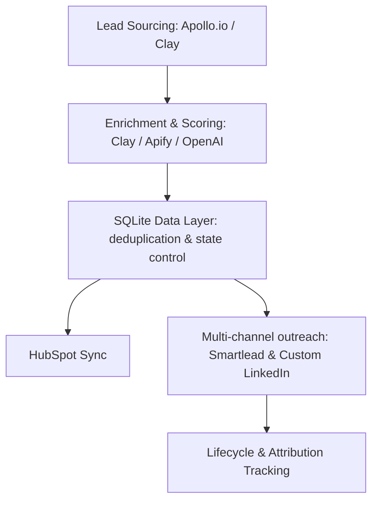

# Project: Amply GTM Automation

## Objective
Build, maintain, and optimize event-driven, production-grade B2B workflow systems and AI orchestration pipelines for Amply (Google-backed).

---

## Current Architecture

---

## Key Achievements & Metrics
- **Cost Savings**: Saved **$1,000/month** by replacing third-party tools with an in-house Multichannel AI Orchestration system (email, LinkedIn, WhatsApp).
- **Deliverability**: Established high-performance cold email infrastructure using domain rotation and warm-up services.
- **Workflow Count**: 20+ active, production-grade workflows in n8n.
- **Outbound Growth**: Increased profile traffic from 10 to 100 visits/day via optimized outreach.

---

## Current Work Checklist

- [x] Design centralized SQLite data layer for n8n deduplication.
- [x] Build HubSpot sync & lead routing workflows.
- [ ] Optimize Smartlead sequencing and automated follow-ups.
- [ ] Build a custom MCP server for scraping and LinkedIn message drafting.
- [ ] Implement advanced error-handling and auto-retry logic for n8n nodes.
